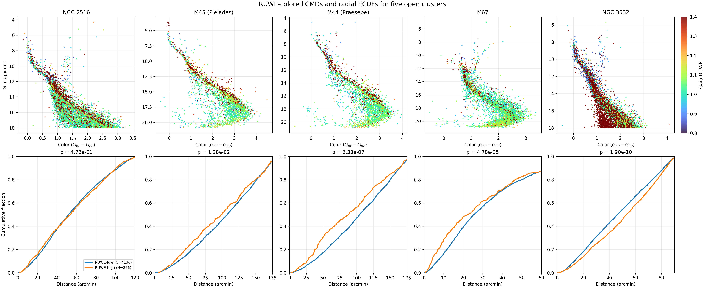

# RUWE Radial KS Clustering

Open-cluster analysis workflow for:

- membership inference with Monte Carlo plus KMeans voting
- Gaia color-magnitude diagram inspection
- RUWE-colored CMD analysis
- radial Kolmogorov-Smirnov tests between RUWE-low and RUWE-high subsamples
- multi-cluster comparison in a single summary figure

This repository is a cleaned public version of the original project notebooks, with a small CLI added so the main steps can be run without manually editing notebook cells.



## What This Repository Contains

- `notebooks/`: cleaned notebooks for interactive exploration
- `scripts/run_analysis.py`: command-line entry point for the main workflow
- `data/raw/`: raw VizieR-style query tables used as membership input
- `data/members/`: final member catalogs used in CMD and radial analyses
- `configs/multicluster_grid.csv`: cluster list for the combined summary plot
- `archive/original-notebooks/`: original step-by-step notebooks kept for provenance

## Workflow

The current public workflow is organized into four main steps:

1. `membership`
   Load a raw Gaia/VizieR table, standardize columns, run Monte Carlo perturbations, cluster with KMeans, and assign membership probabilities by repeated voting.
2. `cmd`
   Plot a standard Gaia color-magnitude diagram from a final member catalog.
3. `ruwe-cmd`
   Plot the same CMD with points colored by RUWE.
4. `radial-ks`
   Compare the radial distributions of RUWE-low and RUWE-high subsamples using a two-sample KS test.

The `grid` command combines the CMD and radial KS view across multiple clusters.

## Data Included

Raw query tables currently included:

- `M45`
- `M44`
- `M67`
- `NGC2516`
- `NGC3532`

Final member catalogs currently included:

- `M45`
- `M44`
- `M67`
- `NGC188`
- `NGC2516`
- `NGC3532`

## Limitation

`NGC188` currently includes only the final member catalog. The raw input table for that cluster is not present in this repository, so the membership-inference step is not yet fully reproducible for `NGC188`.

## Setup

```bash
python3 -m venv .venv
source .venv/bin/activate
pip install -r requirements.txt
```

## Quick Start

Recompute membership for `M67` from the raw table:

```bash
python3 scripts/run_analysis.py membership \
  --input-path data/raw/m67.tsv \
  --output-members data/members/M67_members_recomputed.csv \
  --probability-output data/members/M67_probabilities.csv \
  --cluster-name "M67" \
  --target-pmra -10.9 \
  --target-pmdec -2.9 \
  --target-parallax 1.13 \
  --figure-dir data/figures/generated/m67
```

Make a standard CMD:

```bash
python3 scripts/run_analysis.py cmd \
  --members-csv data/members/M67_Members_Final.csv \
  --cluster-name "M67" \
  --output-figure data/figures/generated/M67_cmd.png
```

Make a RUWE-colored CMD:

```bash
python3 scripts/run_analysis.py ruwe-cmd \
  --members-csv data/members/M67_Members_Final.csv \
  --cluster-name "M67" \
  --output-figure data/figures/generated/M67_ruwe_cmd.png
```

Run the radial KS comparison:

```bash
python3 scripts/run_analysis.py radial-ks \
  --members-csv data/members/M67_Members_Final.csv \
  --cluster-name "M67" \
  --xlim-arcmin 60 \
  --summary-output data/figures/generated/M67_ks_summary.csv \
  --output-figure data/figures/generated/M67_radial_ks.png
```

Build the multi-cluster summary figure:

```bash
python3 scripts/run_analysis.py grid \
  --config-csv configs/multicluster_grid.csv \
  --output-figure data/figures/generated/evolution_grid_generated.png
```

## CLI Summary

```bash
python3 scripts/run_analysis.py --help
python3 scripts/run_analysis.py membership --help
python3 scripts/run_analysis.py cmd --help
python3 scripts/run_analysis.py ruwe-cmd --help
python3 scripts/run_analysis.py radial-ks --help
python3 scripts/run_analysis.py grid --help
```

## Repository Notes

- The cleaned notebooks are the recommended notebook entry points for readers.
- The archived `step1.ipynb` to `step5.ipynb` files are preserved to keep the original workflow history.
- `phot_g_mean_mag` is treated as apparent magnitude unless a distance modulus is provided explicitly in the CLI.
- The radial analysis uses RUWE as an astrometric proxy for subsample comparison, not as a definitive binary classifier.

## Main Files

- [scripts/run_analysis.py](scripts/run_analysis.py)
- [configs/multicluster_grid.csv](configs/multicluster_grid.csv)
- [notebooks/01_membership_inference.ipynb](notebooks/01_membership_inference.ipynb)
- [notebooks/02_color_magnitude.ipynb](notebooks/02_color_magnitude.ipynb)
- [notebooks/03_ruwe_colored_cmd.ipynb](notebooks/03_ruwe_colored_cmd.ipynb)
- [notebooks/04_radial_ks_test.ipynb](notebooks/04_radial_ks_test.ipynb)
